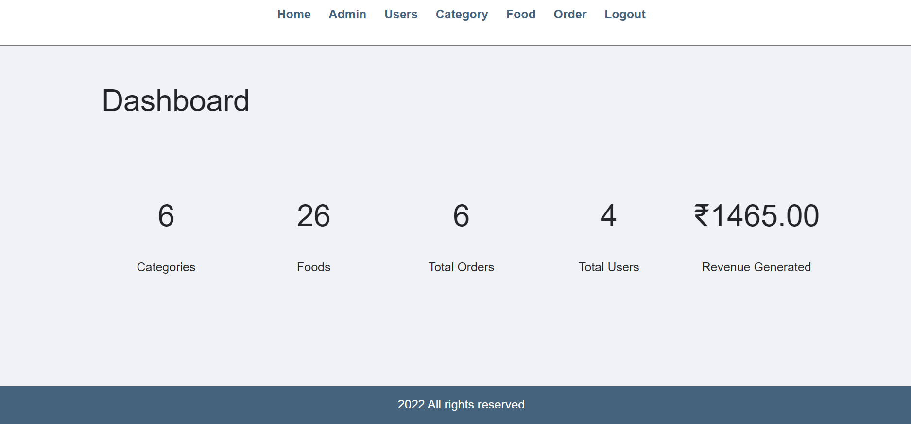

# 🍽️ Food Ordering System

A complete online food ordering website built with PHP and MySQL.

## 📸 Screenshots

| Website | Admin Panel |
|---------|-------------|
|  |  |

## ✨ Features

**User Side:**
- User Registration & Login
- Browse Food by Category  
- Add to Cart
- Place Order
- Order History

**Admin Side:**
- Secure Admin Login
- Manage Categories
- Manage Foods
- Manage Users
- Manage Orders

## 🛠️ Technologies Used

- PHP
- MySQL  
- HTML5 & CSS3
- JavaScript
- XAMPP

## 📥 Installation

1. Install XAMPP server
2. Copy project to `htdocs` folder
3. Start Apache & MySQL
4. Create database `food-order`
5. Import `DATABASE/food-order.sql`
6. Run: `http://localhost/food-order-main`

## 🔐 Login Credentials

**Admin:**
- Username: admin
- Password: admin

## 📧 Contact

**Amruta Koli**  
GitHub: [@amrutakoli167-pixel](https://github.com/amrutakoli167-pixel)

⭐ Star this repository if you like it!
